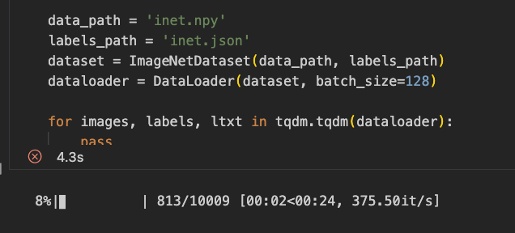

# Imagenet.int8: Entire Imagenet dataset in 5GB


<p align="center">
  
</p>

*original, reconstructed from float16, reconstructed from uint8*

<a href='https://huggingface.co/datasets/cloneofsimo/imagenet.int8'></a>


Find 138 GB of imagenet dataset too bulky? Did you know entire imagenet actually just fits inside the ram of apple watch?

* Resized, Center-croped to 256x256
* VAE compressed with [SDXL's VAE](https://huggingface.co/stabilityai/sdxl-vae)
* Further quantized to int8 near-lossless manner, compressing the entire training dataset of 1,281,167 images down to just 5GB!

Introducing Imagenet.int8, the new MNIST of 2024. After the great popularity of the [Latent Diffusion](https://arxiv.org/abs/2112.10752) (Thank you stable diffusion!), its *almost* the standard to use VAE version of the imagenet for diffusion-model training. As you might know, lot of great diffusion research is based on latent variation of the imagenet. 

These include: 

* [DiT](https://arxiv.org/abs/2212.09748)
* [Improving Traning Dynamics](https://arxiv.org/abs/2312.02696v1)
* [SiT](https://arxiv.org/abs/2401.08740)
* [U-ViT](https://openaccess.thecvf.com/content/CVPR2023/html/Bao_All_Are_Worth_Words_A_ViT_Backbone_for_Diffusion_Models_CVPR_2023_paper.html)
* [Min-SNR](https://openaccess.thecvf.com/content/ICCV2023/html/Hang_Efficient_Diffusion_Training_via_Min-SNR_Weighting_Strategy_ICCV_2023_paper.html)
* [MDT](https://openaccess.thecvf.com/content/ICCV2023/papers/Gao_Masked_Diffusion_Transformer_is_a_Strong_Image_Synthesizer_ICCV_2023_paper.pdf)

... but so little material online on the actual preprocessed dataset. I'm here to fix that. One thing I noticed was that latent doesn't have to be full precision! Indeed, they can be as small as int-8, and it doesn't hurt!

So clearly, it doesn't make sense to download entire Imagenet and process with VAE everytime. Just download this, `to('cuda')` the entire dataset just to flex, and call it a day.😌

(BTW If you think you'll need higher precision, you can always further fine-tune your model on higher precision. But I doubt that.)


# How do I use this?

Previously simo's setup used mosaic-streaming and other huggingface stuff, it must be simplified, i do one mmap and one text file! that's it! 

so u just do , 
```bash
wget https://huggingface.co/ramimmo/mini.imgnet.int8/resolve/main/inet.txt
wget https://huggingface.co/ramimmo/mini.imgnet.int8/resolve/main/inet.npy
```

then u use this, simple function, u don't need inet.txt file if u don't need it!
```python

import numpy as np
import torch
import tqdm
from torch.utils.data import Dataset, DataLoader

class ImageNetDataset(Dataset):
    def __init__(self, data_path, labels_path=None):
        self.data = np.memmap(data_path, dtype='uint8', mode='r', shape=(1_281_152, 4097))
        if labels_path is not None:
            with open(labels_path, 'r') as f:
                self.labels_txt = [(line.strip()) for line in f]

    def __len__(self):
        return len(self.data)

    def __getitem__(self, idx):
        image = self.data[idx]
        image, label = image[:-1], image[-1]
        image = image.astype(np.float32).reshape(4, 32, 32)
        image = (image / 255.0 - 0.5) * 24.0
        image = torch.tensor(image, dtype=torch.float32)
        label = torch.tensor(label, dtype=torch.long)
        
        if hasattr(self, 'labels_txt'):
            return image, label, self.labels_txt[idx]
        return image, label

data_path = 'inet.npy'
labels_path = None#'inet.txt'
dataset = ImageNetDataset(data_path, labels_path)
dataloader = DataLoader(dataset, batch_size=128)

for images, labels in tqdm.tqdm(dataloader):
    # print(images.shape, labels.shape)
    pass


```


voila, you have onefile imagenet on your hand! 5GB only! you don't need streaming library u can use dataloader samplers and primitives , don't overthink it!
 
We're iterating at 23k img/second, that's 5x faster than mosaic streaming, and we're not limited by performance artifacts of random sampling from chunked datasets!
```python
###### Example Usage. Decode back the 5th image. BTW shuffle plz
from diffusers.models import AutoencoderKL
from diffusers.image_processor import VaeImageProcessor

model = "stabilityai/your-stable-diffusion-model"
vae = AutoencoderKL.from_pretrained("stabilityai/sdxl-vae").to("cuda:0")

vae_latent, idx, text_label = next(iter(dataloader))

print(f"idx: {idx}, text_label: {text_label}, latent: {vae_latent.shape}")
# idx: 402, text_label: acoustic guitar, latent: torch.Size([1, 4, 32, 32])

# example decoding
x = vae.decode(vae_latent.cuda()).sample
img = VaeImageProcessor().postprocess(image = x.detach(), do_denormalize = [True, True])[0]
img.save("someimage.png")
```

Enjoy!

# Citations

If you find this material helpful, consider citation!

```bibtex
@misc{imagenet_int8,
  author       = {Simo Ryu},
  title        = {Imagenet.int8: Entire Imagenet dataset in 5GB},
  year         = 2024,
  publisher    = {Hugging Face Datasets},
  url          = {https://huggingface.co/datasets/cloneofsimo/imagenet.int8},
  note         = {Entire Imagenet dataset compressed to 5GB using VAE and quantized with int8}
}

@misc{mini_inet_int8,
  author       = {Rami Seid},
  title        = {Making imagenet8 even easier},
  year         = 2024,
  publisher    = {Hugging Face Datasets},
  url          = {https://github.com/SonicCodes/imagenet.int8},
  note         = {Updated version of Simo Ryu's Imagenet.int8 to make it super easy to use}
}
```
